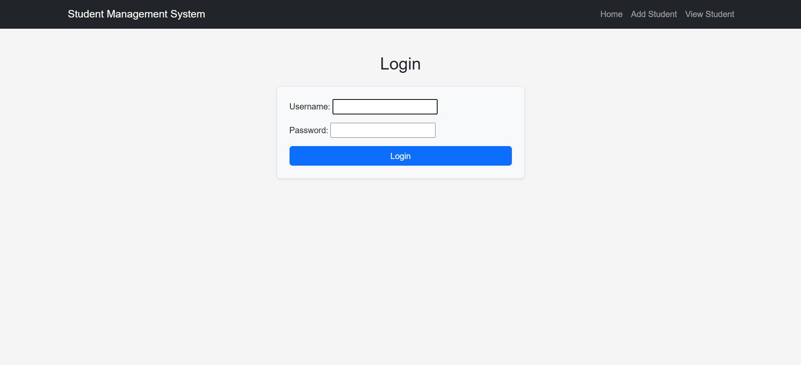
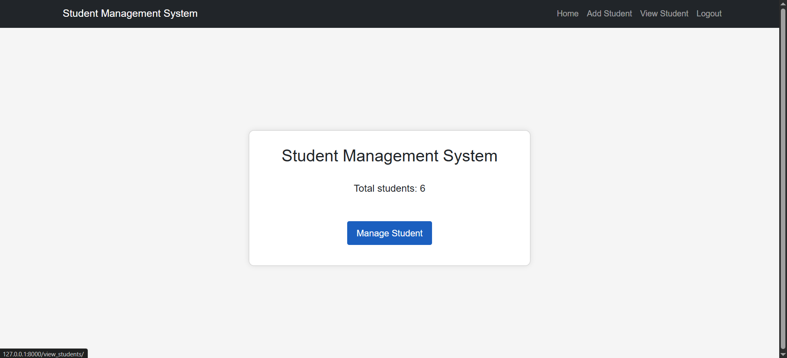
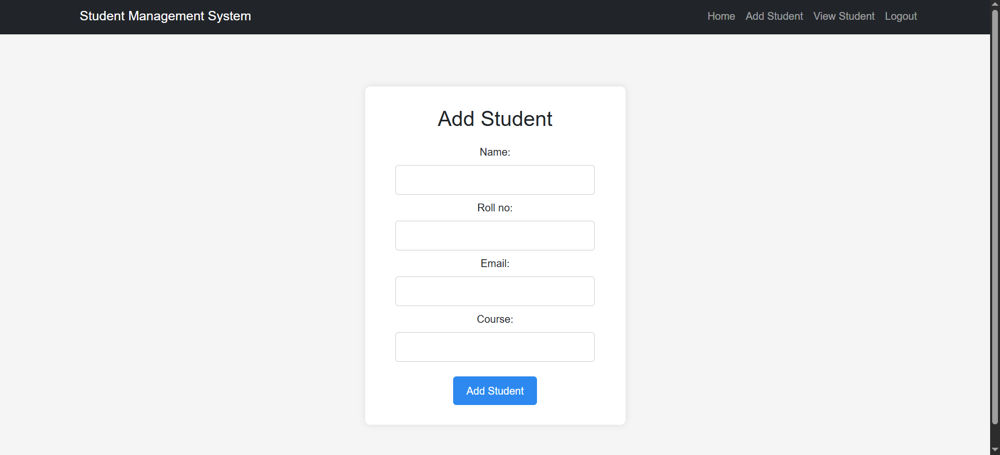
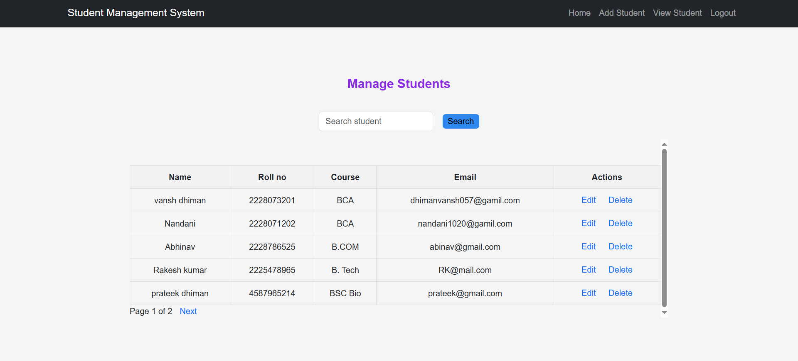
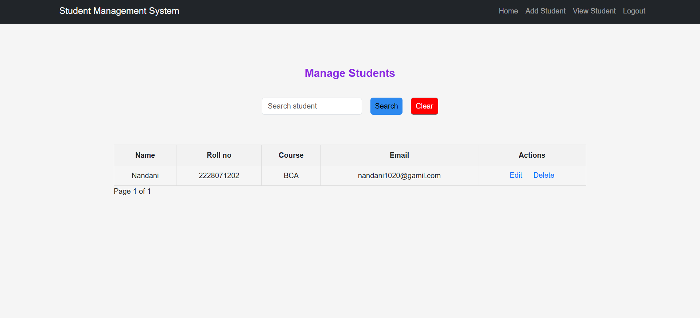
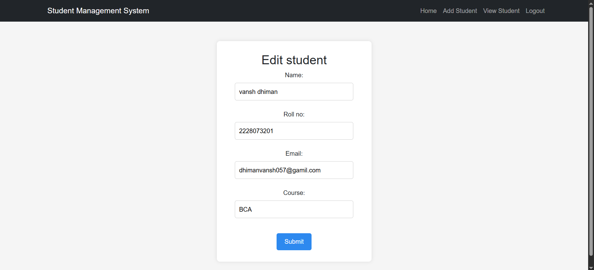

# 🎓 Student Management System

A Django-based web application that allows authenticated users to efficiently manage student records. The application provides complete CRUD (Create, Read, Update, Delete) functionality along with search, pagination, form validation, and a responsive user interface.

---

## 📌 Features

- 🔐 User Authentication (Login Required)
- 🏠 Dashboard displaying the total number of students
- ➕ Add Student
- 📋 View Student Records
- ✏️ Update Student Information
- 🗑️ Delete Student Records
- 🔍 Search Students by Name
- 📄 Pagination (5 students per page)
- ✅ Form Validation using Django ModelForm
- 💬 Success Messages using Django Messages Framework
- 📱 Responsive User Interface using Bootstrap

---

## 🛠️ Technologies Used

- Python 3
- Django
- SQLite
- HTML5
- CSS3
- Bootstrap 5
- Django ORM

---

## 📂 Student Information

Each student record contains:

- Name
- Roll Number
- Email Address
- Course

---

## 📸 Screenshots

### 🔐 Login Page



---

### 🏠 Dashboard



---

### ➕ Add Student



---

### 📋 View Students



---

### 🔍 Search Students



---

### ✏️ Edit Student



---

## 🚀 Installation

### 1. Clone the repository

```bash
git clone https://github.com/Vanshdhiman570/student-management-system.git
```

### 2. Navigate to the project directory

```bash
cd student-management-system
```

### 3. Install the required dependencies

```bash
pip install -r requirements.txt
```

### 4. Apply database migrations

```bash
python manage.py migrate
```

### 5. Create a superuser (Optional)

```bash
python manage.py createsuperuser
```

### 6. Run the development server

```bash
python manage.py runserver
```

### 7. Open the application

Visit:

```
http://127.0.0.1:8000/
```

---

## 📁 Project Structure

```text
student-management-system/
│
├── Student_Management_System/
├── myapp/
├── screenshots/
├── staticfiles/
├── manage.py
├── requirements.txt
├── Procfile
├── README.md
└── .gitignore
```

---

## 📈 Future Improvements

- Search by Roll Number, Email, and Course
- Student Details Page
- Dashboard with Student Statistics
- Export Student Data (CSV/PDF)
- Profile Images for Students
- Improved User Interface

---

## 👨‍💻 Author

**Vansh Dhiman**

GitHub: https://github.com/Vanshdhiman570

---

## 📄 License

This project is created for learning and portfolio purposes.
